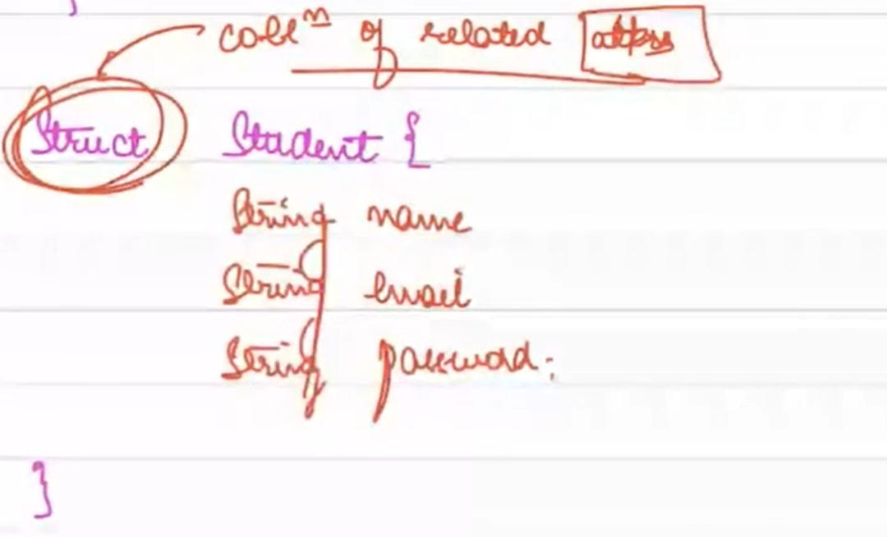
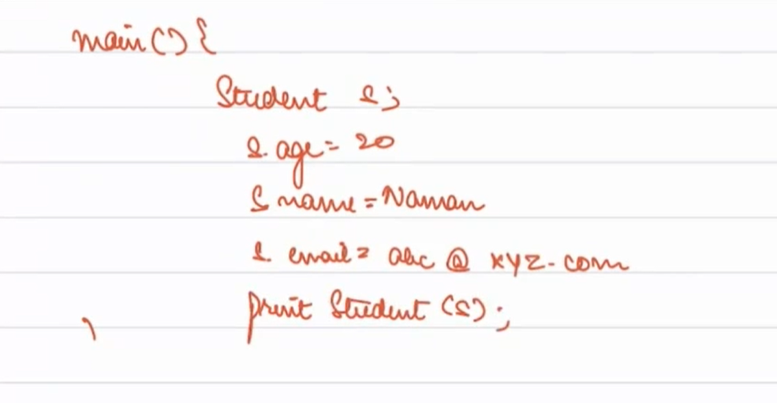
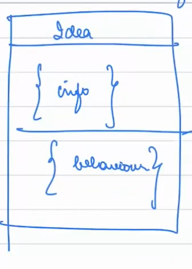
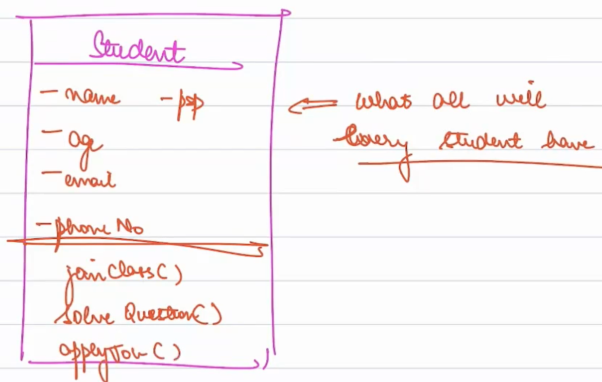
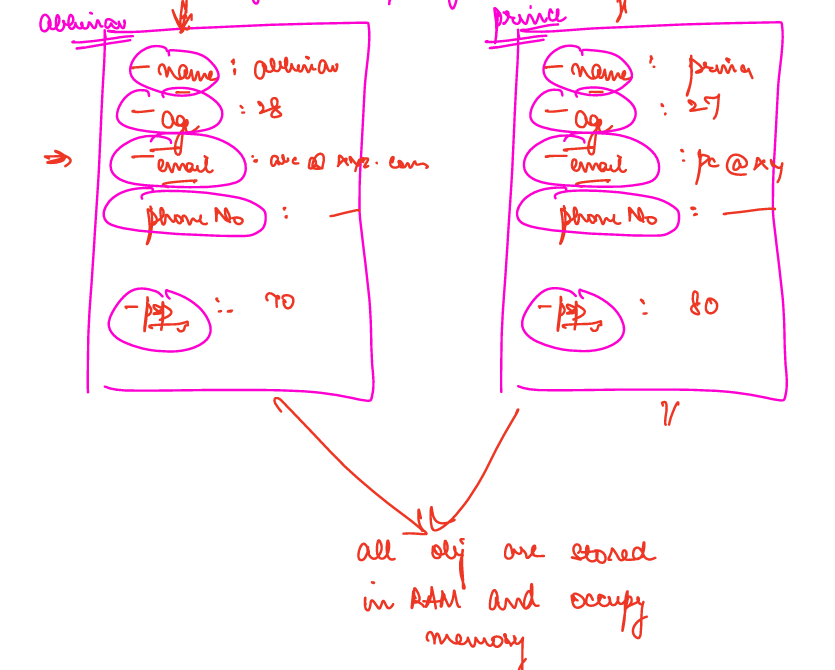

# Introduction to Procedural Programming and Object Oriented Programming (OOP)

## Procedural Programming

Procedural programming organizes code into a series of procedures or functions. A procedure is a set of instructions to accomplish a specific task. In programming languages, procedures are encapsulated in functions or methods.

### Understanding Procedures 📜

A procedure is essentially a sequence of instructions designed to achieve a particular action or task. It serves as a structured way to group and manage a series of steps required to perform an operation.

### Functions in Programming 📚

In programming languages, we group sets of related actions or instructions into functions or methods. This modular approach enhances code readability and maintainability. Functions encapsulate specific functionalities, making it easier to understand and manage complex logic.

### Transition to OOP 🔄

The transition from procedural programming to Object Oriented Programming (OOP) involves a fundamental shift in the way we approach software design. OOP centers around the idea of entities and their interactions, promoting a more organized and maintainable codebase.

### Limitations of Procedural Programming ⚠️

While procedural programming has its merits, it also comes with limitations, especially when dealing with intricate systems:

- **Complexity**: As systems grow, managing scattered procedures becomes challenging.
- **Debugging**: Tracing bugs across multiple procedures can be time-consuming.
- **Maintenance**: Spaghetti code, where code becomes tangled and hard to modify, can hinder efficient maintenance.

## Object Oriented Programming (OOP)

In OOP, entities take center stage, and each entity manages its own actions. OOP is built on three key pillars: Encapsulation, Inheritance, and Polymorphism.

### Principles and Pillars of OOP ✨

OOP is guided by a core principle and three pillars:

- **Core Principle: Abstraction** 🌍
    - Abstraction involves representing complex software systems through distinct entities, each equipped with attributes and behaviors.
    - Abstraction allows us to think of an entity in terms of what it does, without needing to know the internal complexities.

- **Pillars**: The three pillars of OOP, namely Encapsulation, Inheritance, and Polymorphism, work hand in hand to allow abstraction in real life scenarios.

## Abstraction: Thinking in Ideas 🌟

**What is Abstraction?**
Abstraction is more than just hiding details. It's about representing something in terms of ideas. Abstract means thinking of something in terms of its essence, not the nitty-gritty details.

**Defining Abstraction:**
- Representing a complex software system in terms of different ideas (entities) interacting with each other.
- Think of ideas as things that have info or behavior associated with them.
- Every idea should ideally have associated behaviors.
- Examples of ideas: Mentor, Student, Teacher, Batch, Job, Assignment, etc.

**Benefits of Abstraction:**
- People interacting with an idea don't need to know all the internal details.
- Ideas are structured so anyone can work with them without understanding their internal complexity.
- For example, driving a car: You call wheel.left(), wheel.right(), and Wheel.brake() without needing to understand the car's internal mechanics.

**Abstraction is About:**
- Representing complex systems through ideas.
- Ideas have attributes (info/data) and behaviors.
- Others don't need to know the internal complexity.

## Encapsulation: Keeping Things Together 🏛️

Encapsulation involves bundling related information and behaviors of an entity together. It prevents unauthorized access to an entity's attributes or behaviors.

### Visualizing Encapsulation 💡

- Encapsulation is like a capsule: In medical terms, it keeps medicine together and protects it from external influences.
- In OOP, encapsulation means everything related to an idea is held together.
- It allows us to store all information and behaviors associated with an idea together.
- Encapsulation prevents other ideas from accessing attributes or behaviors they shouldn't access.

### Classes and Objects 🌐

- **Class**: Think of it as a blueprint that defines an idea's attributes and behaviors.
- **Object**: It's an actual instance created from a class.

Encapsulation is achieved through classes and objects. A class encapsulates attributes and behaviors, and an object is an instance of a class.

### Applying Encapsulation with Classes and Objects 💡

Imagine we have a `Student` class encapsulating student attributes and behaviors. One of these behaviors could be a method called `printStudent()` that displays student information.

#### Utilizing Encapsulation for Printing Students 📄

Now, let's consider how encapsulation comes into play when invoking the `printStudent()` method:

- Instead of passing individual values like name, age, and email to the `printStudent()` method, we create a **Student object** that encapsulates all these attributes.
- This object serves as a container holding all the necessary data about the student.
- When invoking the `printStudent()` method, we pass this object as a parameter.
- This practice simplifies the method call and promotes code organization and clarity.
-  
- - An image depicting the process of calling the `printStudent()` method using a Student object.

#### Benefits of Encapsulation in Action 🏆

- **Cleaner Code**: Passing an object with all required data reduces the need for multiple parameters, resulting in cleaner, more readable code.
- **Easier Maintenance**: If attributes change or new ones are added, you only need to update the Student class and its methods, not every call site.
- **Consistency**: Encapsulation ensures consistent handling of student data across the application.

In summary, encapsulation is like creating a guarded vault for your entity, preserving its essence and ensuring controlled access to its vital aspects.

- 
### Classes and Objects: Blueprint and Instances 🏗️

In Object-Oriented Programming (OOP), classes and objects are essential concepts that enable the creation of structured and organized code.

#### Classes: Blueprints of Ideas 📝

- **Class**: Think of it as a blueprint or template that defines the attributes and behaviors associated with an idea. Much like how an architect creates a blueprint for a house:
    - Imagine building a house; an architect designs a blueprint detailing room sizes and the overall structure.
    - This blueprint isn't a physical house, but a representation of it. It doesn't take up physical space.
    - A single blueprint can be used to construct multiple houses with the same design.

- **Class in OOP**: Similarly, a class is a blueprint for an idea. Each idea in your software system will have attributes and behaviors associated with it.
    - Consider a `Student` class. It encapsulates everything that every student will have: attributes like name, age, and behaviors like attending classes and solving questions.
    - The `Student` class encapsulates the essential attributes and behaviors that define a student's role in your application.
    -  - A visual representation of the `Student` class with attributes and behaviors.

- **Memory Usage**: Classes themselves don't consume memory. They are definitions, instructions for creating objects. If you don't create any instances (objects) of a class, it won't use any memory.

- **Infinite Objects**: With just one class, you can create an unlimited number of objects. Each object is an independent instance based on the class blueprint.

#### Objects: Instances of Reality 🌟

- **Object**: An object is a real, tangible instance created from a class. It embodies the attributes and behaviors defined in the class blueprint.
- **Real-world Analogy**: Think of a class as a cookie cutter and objects as the actual cookies. Each cookie has the same shape and structure, but they can have different flavors and decorations.
- **Memory Usage**: Objects do occupy memory in your computer's RAM. They hold the specific data associated with their attributes.
- **Isolation and Independence**: Each object is isolated from other objects. Changes made to one object don't affect others.
-  
-  An illustrative diagram showing multiple objects (students) with distinct attributes encapsulated within each.

### Conclusion 🌟

Understanding classes and objects is pivotal to mastering OOP. Classes define the structure, attributes, and behaviors of ideas, while objects bring those ideas to life as real instances. This distinction provides a powerful way to organize, model, and interact with the elements of your software system.

### Pillars of OOP: Bridging the Gap 🏛️

Pillars of OOP—Encapsulation, Inheritance, and Polymorphism—bring the principles of abstraction into reality.
Further we will cover in next module. 