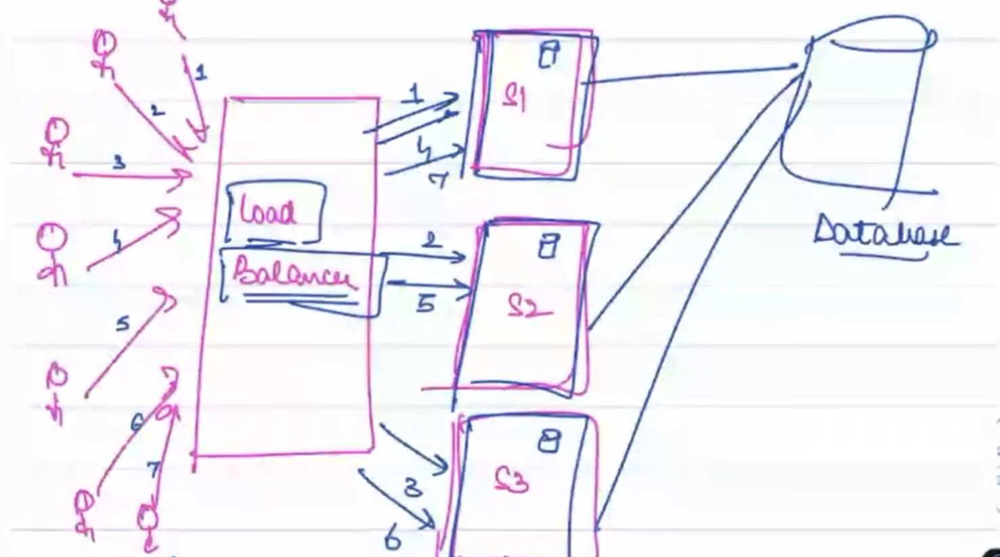

# Backend LLD: Intro to LLD and HLD

Welcome to the "Introduction to Low Level Design (LLD)" module. This module provides a foundation for understanding LLD by first exploring High Level Design (HLD) concepts.

## Table of Contents

- [HLD Overview](#hld-overview)
- [Load Distribution and Balancing](#load-distribution-and-balancing)
- [Software Architecture Layers](#software-architecture-layers)
- [Transition to LLD](#transition-to-lld)
- [Importance of LLD](#importance-of-lld)

## HLD Overview

High Level Design (HLD) offers a bird's eye view of software architecture. It correlates various infrastructure layers that collaborate to serve an application at scale.

### Example: Building Facebook

In the context of creating Facebook, can a single server accommodate global user traffic? No, this would lead to bottlenecks.

### Load Distribution and Balancing
To handle substantial user loads, load distribution across multiple servers is necessary. Load balancers distribute requests evenly for optimal performance.

## Software Architecture Layers
Software doesn't run on a single machine. Applications, servers, and databases may reside on different computers. HLD diagrams provide an overview of how they interconnect.

## Transition to LLD

The transition from HLD to LLD is crucial. LLD delves into detailed software code structure, classes, methods, attributes, and more.

## Importance of LLD

LLD helps engineers write better code. An average software engineer spends only 12% of their time coding. The remaining time involves meetings, reading PRDs, code reviews, bug solving, and thinking. LLD enhances problem-solving skills.

### Properties of Better Code

1. Readability and Understandability
2. Reusability (DRY Principle)
3. Extensibility
4. Maintainability

---

Feel free to reach out if you have any questions or feedback about this module. Happy learning!
